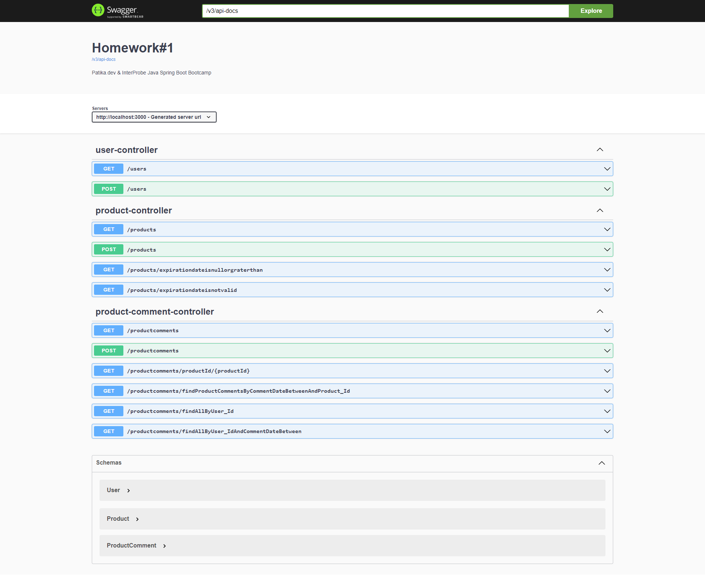

# 216-InterProbe-Java-Spring-Bootcamp First Homework#1

Interprobe -> ÖDEV -1 : (20.06.2022 )

1. Alanları aşağıda belirtilen entity'leri oluşturunuz.

| Kullanıcı        | Urun                                | UrunYorum          |
| ---------------- | ----------------------------------- | ------------------ |
| Id               | Id                                  | Id                 |
| Adı(50 char)     | Adı                                 | Yorum(500 char)    |
| Soyadı(50 char)  | Fiyat                               | yorumTarihi (date) |
| Email(50 char)   | Son Kullanma Tarihi (null olabilir) | urunId             |
| telefon(15 char) |                                     | kullaniciId        |

Repository içinde;

2. Bir ürüne ait yorumları listeleyen bir metot yazınız.

3. Verilen tarih aralıklarında belirli bir ürüne yapılmış olan yorumları gösteren bir metot yazınız.

4. Bir kullanıcının yapmış olduğu yorumları listeleyen bir metot yazınız.

5. Bir kullanıcının belirli tarihler aralığında yapmış olduğu yorumları gösteren bir metot yazınız.

6. Son kullanma tarihi geçmiş ürünleri listeleyen bir metot yazınız.

7. Son kullanma tarihi geçmemiş ürünleri listeleyen bir metot yazınız. (Son kullanma tarihi boş
   olanlar da gelmeli.
